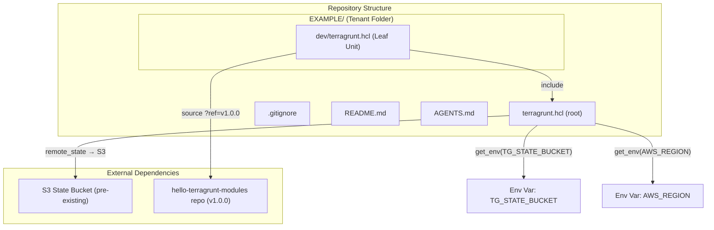
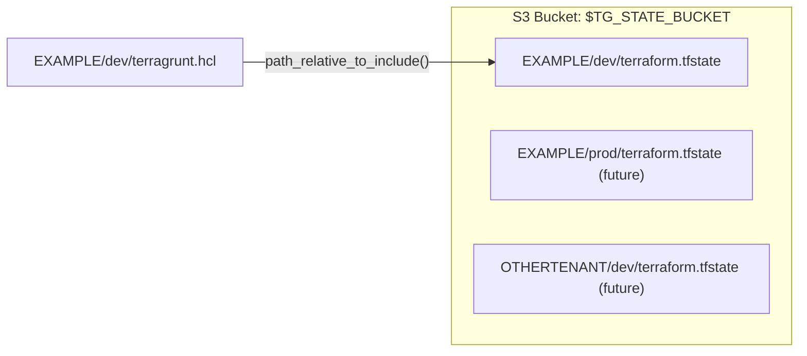

# Design Document

## Overview

This design establishes the foundational Terragrunt live infrastructure for the hello-terragrunt-live repository. It defines the root configuration for shared remote state management via S3, the folder structure for multi-tenant isolation, and the first tenant ("EXAMPLE") with a dev environment. The design follows the Terragrunt "live repo + modules repo" pattern, where this repository contains only configuration that references versioned modules from the [hello-terragrunt-modules](https://github.com/hoangviet1vu/hello-terragrunt-modules) repo.

Key design decisions:
- **Environment variables for state bucket and region**: The S3 bucket name is read from `TG_STATE_BUCKET` and the AWS region from `AWS_REGION` via `get_env()`, enabling multiple developers/CI systems to target different buckets and regions without modifying shared config.
- **No DynamoDB state locking**: State locking via DynamoDB is not required at this time. The remote state configuration uses S3 only.
- **Path-based state key derivation**: State keys are automatically derived from the folder hierarchy using `path_relative_to_include()`, guaranteeing isolation without manual key management.
- **Pinned module versions**: Leaf units always reference modules via `?ref=vX.Y.Z` git tags, never branch references, ensuring reproducible infrastructure.

## Architecture



### State Isolation Model



The state key for each leaf unit is `<tenant-id>/<env>/terraform.tfstate`, derived automatically from the folder path. This means adding a new tenant or environment never requires state configuration changes — simply creating the folder in the correct hierarchy is sufficient.

## Components and Interfaces

### 1. Root Configuration (`terragrunt.hcl`)

**Purpose**: Defines shared remote state backend and AWS provider configuration inherited by all leaf units.

**Responsibilities**:
- Read `TG_STATE_BUCKET` environment variable via `get_env()` for the S3 bucket name
- Read `AWS_REGION` environment variable via `get_env()` for the AWS region
- Fail with a descriptive error if either variable is unset or empty
- Configure S3 remote state with:
  - Bucket from `TG_STATE_BUCKET` environment variable
  - Key derived from `path_relative_to_include()` + `/terraform.tfstate`
  - Region from `AWS_REGION` environment variable
  - Server-side encryption enabled
- Generate a `provider.tf` file with the AWS provider block (region from `AWS_REGION`)

**Interface (inherited by leaf units)**:
- Provides `remote_state` configuration
- Provides `generate "provider"` block

### 2. Leaf Unit (`EXAMPLE/dev/terragrunt.hcl`)

**Purpose**: Per-environment Terragrunt unit that specifies what module to deploy and with what inputs.

**Responsibilities**:
- Include the root config via `find_in_parent_folders()`
- Specify module source with pinned version tag
- Pass environment-specific inputs to the module

**Interface (inputs to module)**:
| Input | Value | Description |
|-------|-------|-------------|
| `tenant_name` | `"EXAMPLE"` | Tenant identifier |
| `environment` | `"dev"` | Deployment environment |
| `enable_dynamodb` | `false` | DynamoDB table creation flag |
| `enable_ecr` | `true` | ECR repository creation flag |

### 3. Gitignore (`.gitignore`)

**Purpose**: Prevent Terraform state files, lock files, and local cache from being committed to version control.

**Patterns required**:
- `*.tfstate` — state files
- `*.tfstate.*` — state backup files
- `.terraform.tfstate.lock.info` — transient lock files
- `.terraform/` — local provider/plugin cache

### 4. Documentation (`README.md` and `AGENTS.md`)

**Purpose**: Provide setup instructions and operational context for human developers and AI agents respectively.

**Required content for both**:
- State bucket is pre-existing and not managed by Terragrunt
- `TG_STATE_BUCKET` environment variable: purpose, required status, example usage
- `AWS_REGION` environment variable: purpose, required status, example usage

## Data Models

### Root Config Structure (HCL)

```hcl
remote_state {
  backend = "s3"
  config = {
    bucket  = get_env("TG_STATE_BUCKET", "")
    key     = "${path_relative_to_include()}/terraform.tfstate"
    region  = get_env("AWS_REGION", "")
    encrypt = true
  }
  generate = {
    path      = "backend.tf"
    if_exists = "overwrite_terragrunt"
  }
}

generate "provider" {
  path      = "provider.tf"
  if_exists = "overwrite_terragrunt"
  contents  = <<EOF
provider "aws" {
  region = "${get_env("AWS_REGION", "")}"
}
EOF
}
```

**Note**: The `get_env("TG_STATE_BUCKET", "")` and `get_env("AWS_REGION", "")` calls with empty defaults combined with validation logic ensure the build fails descriptively if either variable is not set. Alternatively, Terragrunt's newer syntax `get_env("TG_STATE_BUCKET")` / `get_env("AWS_REGION")` (no default) will error automatically, but a custom validation block provides a more user-friendly error message.

### Leaf Unit Structure (HCL)

```hcl
include "root" {
  path = find_in_parent_folders()
}

terraform {
  source = "git::https://github.com/hoangviet1vu/hello-terragrunt-modules.git//tenant-base?ref=v1.0.0"
}

inputs = {
  tenant_name    = "EXAMPLE"
  environment    = "dev"
  enable_dynamodb = false
  enable_ecr     = true
}
```

### State Key Derivation

| Leaf Unit Path | `path_relative_to_include()` | State Key |
|----------------|-------------------------------|-----------|
| `EXAMPLE/dev/terragrunt.hcl` | `EXAMPLE/dev` | `EXAMPLE/dev/terraform.tfstate` |
| `EXAMPLE/prod/terragrunt.hcl` | `EXAMPLE/prod` | `EXAMPLE/prod/terraform.tfstate` |
| `TENANT2/dev/terragrunt.hcl` | `TENANT2/dev` | `TENANT2/dev/terraform.tfstate` |

### Folder Hierarchy

```
hello-terragrunt-live/
├── terragrunt.hcl          # Root config (state backend + provider)
├── .gitignore              # Excludes state files and .terraform/
├── README.md               # Human documentation
├── AGENTS.md               # AI agent documentation
├── LICENSE
└── EXAMPLE/
    └── dev/
        └── terragrunt.hcl  # Leaf unit (module source + inputs)
```

## Error Handling

### Missing TG_STATE_BUCKET or AWS_REGION

The root config must fail early and clearly when `TG_STATE_BUCKET` or `AWS_REGION` is not set. Two approaches:

1. **Recommended**: Use `get_env("TG_STATE_BUCKET")` and `get_env("AWS_REGION")` without defaults — Terragrunt will error with a message indicating the variable is not set.
2. **Alternative**: Use a validation block or locals check that produces a custom error message.

The recommended approach is simpler and idiomatic for Terragrunt.

### Module Source Unreachable

If the git source URL is unreachable (private repo without credentials, network issue), Terragrunt/Terraform will fail during `init` with a descriptive git clone error. This is handled by Terraform natively. Documentation should cover authentication options (SSH vs HTTPS with token).

### S3 Bucket Does Not Exist

If the S3 bucket specified in `TG_STATE_BUCKET` does not exist, Terragrunt will attempt to create it (default behavior with `remote_state`). If this is undesirable, the `disable_bucket_creation` flag can be set. The current design relies on Terragrunt's default auto-creation behavior or manual pre-provisioning as documented.

## Testing Strategy

### Why Property-Based Testing Does Not Apply

This feature is pure **Infrastructure as Code (IaC)** — it defines Terragrunt/Terraform configuration files, folder structures, and documentation. There are no pure functions, data transformations, or algorithmic logic to validate with property-based testing. The "inputs" are static configuration values, not a variable input space.

### Recommended Testing Approaches

#### 1. Static Validation (Formatting & Linting)
- Run `terraform fmt -check -recursive .` to verify formatting
- Run `tflint --recursive` to catch configuration issues
- These validate all `.hcl` and `.tf` files meet style requirements

#### 2. Terragrunt Validate
- Run `terragrunt validate` in each leaf unit directory to verify HCL syntax and configuration correctness
- Requires `TG_STATE_BUCKET` to be set (can use a dummy value for syntax-only validation)

#### 3. Structure Verification (Example-Based)
- Verify `EXAMPLE/` directory exists and is uppercase
- Verify `EXAMPLE/dev/` directory exists and is lowercase
- Verify `EXAMPLE/dev/terragrunt.hcl` file exists
- Verify root `terragrunt.hcl` exists

#### 4. Content Verification (Example-Based)
- Verify root `terragrunt.hcl` contains `get_env("TG_STATE_BUCKET"` (no hardcoded bucket)
- Verify root `terragrunt.hcl` contains `get_env("AWS_REGION"` (no hardcoded region)
- Verify root `terragrunt.hcl` does NOT contain a hardcoded region string as a local value
- Verify root `terragrunt.hcl` contains `path_relative_to_include()`
- Verify root `terragrunt.hcl` contains `encrypt = true`
- Verify leaf unit contains `?ref=v` (pinned version, not branch)
- Verify leaf unit contains expected inputs (`enable_ecr = true`, `enable_dynamodb = false`)
- Verify `.gitignore` contains `*.tfstate`, `*.tfstate.*`, `.terraform.tfstate.lock.info`, `.terraform/`

#### 5. Documentation Verification (Example-Based)
- Verify `README.md` mentions `TG_STATE_BUCKET`
- Verify `README.md` mentions `AWS_REGION`
- Verify `README.md` mentions pre-existing S3 bucket
- Verify `AGENTS.md` mentions `TG_STATE_BUCKET`
- Verify `AGENTS.md` mentions `AWS_REGION`
- Verify `AGENTS.md` mentions pre-existing S3 bucket

#### 6. Integration Test (Optional, Manual)
- Set `TG_STATE_BUCKET` to a real bucket
- Run `terragrunt plan` in `EXAMPLE/dev/`
- Confirm plan succeeds and state path is `EXAMPLE/dev/terraform.tfstate`

### Test Execution Order

1. `terraform fmt -check -recursive .` (fast, no AWS needed)
2. `tflint --recursive` (fast, no AWS needed)
3. Structure and content verification scripts (fast, no AWS needed)
4. `terragrunt validate` per leaf unit (needs `TG_STATE_BUCKET` and `AWS_REGION` set)
5. `terragrunt plan` (needs AWS credentials + real bucket + `AWS_REGION`)
