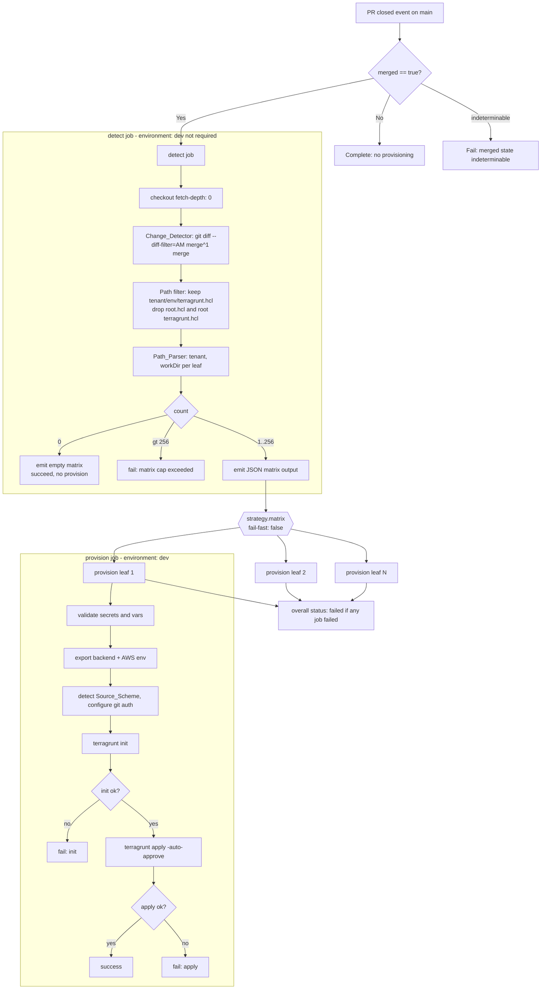

# Design Document

## Overview

This feature adds a single GitHub Actions workflow to the `hello-terragrunt-live`
repository that provisions tenant platforms automatically when a pull request is
merged into `main`. The workflow follows a **two-stage design**:

1. **`detect` job** — a single job that determines which *leaf* Terragrunt units
   (`<tenant>/<env>/terragrunt.hcl`) were added or modified by the merged pull
   request, and emits that set as a JSON **matrix** output.
2. **`provision` job** — a matrix job that consumes the detect output and fans out
   one run per changed leaf unit, each bound to the `dev` GitHub Environment, each
   authenticating to the private modules repo and running Terragrunt against the
   leaf's directory.

The design deliberately isolates a **pure-logic core** — the path filter and matrix
builder — from the CI/Terragrunt plumbing. That core is the only part of the system
with input-dependent behavior worth testing exhaustively (see
[Correctness Properties](#correctness-properties)); the remaining wiring is
declarative CI configuration validated with `actionlint` and example-based tests.

### Repository grounding

The design is grounded in the actual repository:

- **Root config** is `root.hcl` (not a top-level `terragrunt.hcl`). It declares an
  S3 `remote_state` block whose `key` is `"${path_relative_to_include()}/terraform.tfstate"`,
  and reads `TG_STATE_BUCKET` and `AWS_REGION` via `get_env(...)`. It also generates
  an AWS provider block using `AWS_REGION`. Because the key is derived from
  `path_relative_to_include()`, running Terragrunt from `<TENANT>/<env>` yields state
  at `s3://<TG_STATE_BUCKET>/<TENANT>/<env>/terraform.tfstate` — fully isolated per
  leaf. (Requirements 7, 8)
- **Leaf units** live at `<TENANT>/<env>/terragrunt.hcl` (e.g. `SAMPLETENANT/dev/terragrunt.hcl`),
  `include` the root via `find_in_parent_folders("root.hcl")`, declare a
  `terraform { source = "git::..." }` pointing at `hoangviet1vu/hello-terragrunt-modules`,
  and pass inputs `tenant_name`, `environment`, `enable_dynamodb`, `enable_ecr`.
  The sample leaf uses the **SSH** source form
  (`git::git@github.com:hoangviet1vu/hello-terragrunt-modules.git//?ref=...`), but the
  README documents both SSH and HTTPS forms, so the workflow must support both.
  (Requirements 9, 10)

> Note: `AGENTS.md` describes the root file as a top-level `terragrunt.hcl`, while the
> repository actually uses `root.hcl`. The path filter therefore excludes **both**
> `root.hcl` (at any depth) and any repo-root `terragrunt.hcl` (Requirements 2.2, 2.3),
> which keeps the workflow correct regardless of which convention a future change uses.

## Architecture

### Why `pull_request` (closed + merged) over `push`

The workflow triggers on `on.pull_request` with `types: [closed]`, gated by
`if: github.event.pull_request.merged == true`. This is chosen over `on.push` to
`main` for several reasons tied directly to the requirements:

- **Reviewed-and-approved provenance (Req 1).** The requirement is to provision only
  from *merged pull requests*, not from arbitrary pushes. A `push` trigger fires for
  direct pushes and administrative operations that never went through review; the
  `pull_request` closed event fires exactly once per PR resolution and carries the
  `merged` boolean.
- **Explicit merged-state gate (Req 1.2, 1.3, 1.5).** The `pull_request` payload exposes
  `github.event.pull_request.merged`. A closed-but-not-merged PR (`merged == false`) is
  distinguishable from a merged one, letting the workflow skip provisioning yet complete
  successfully (1.2), and evaluate merged state *before* change detection (1.3). A `push`
  event has no equivalent signal.
- **Base-branch scoping (Req 1.4).** `on.pull_request.branches: [main]` ensures the
  workflow does not even start for PRs whose base is not `main`.
- **First-parent diff availability (Req 3.1).** For a merged PR, the merge commit's
  first parent is the tip of `main` before the merge, so `git diff <merge>^1 <merge>`
  yields exactly the PR's net added/modified files. Squash/rebase merges collapse to a
  single commit on `main` whose first parent is the previous `main` tip, so the same
  first-parent comparison still isolates the PR's change set.

The gate has two layers so an indeterminable payload fails loudly rather than silently
provisioning: the job-level `if` handles the normal merged/not-merged split (1.2, 1.4),
and an explicit early step fails the workflow if `merged` is neither `true` nor `false`
(1.5).

### Stage diagram



### Job dependency and status flow

- `provision` declares `needs: detect` and `strategy.matrix` sourced from the detect
  job's `matrix` output.
- `strategy.fail-fast: false` ensures a single leaf failure does not cancel siblings
  (Req 5.7, 11.3). GitHub aggregates the matrix leg results into the job conclusion, so
  any failed leg makes `provision` fail, which makes the workflow run fail
  (Req 5.8, 11.4). If every leg succeeds, the run succeeds (Req 11.5).
- When the matrix is empty, `provision` is skipped entirely and the run still concludes
  successfully (Req 2.4, 3.4, 5.4).

## Components and Interfaces

### Change_Detector (in `detect` job)

Responsibility: compute the added/modified file set of the merged PR and reduce it to a
list of leaf-unit paths. (Requirements 3.1–3.5)

- Requires full history: checkout uses `fetch-depth: 0` so the merge commit's first
  parent is present locally (Req 3.1). The merge SHA is `github.event.pull_request.merge_commit_sha`.
- Computes the change set with:
  `git diff --name-only --diff-filter=AM "<merge_sha>^1" "<merge_sha>"`
  - `--diff-filter=AM` retains only **A**dded and **M**odified files, excluding deleted
    and renamed-away files (Req 3.3). (`--diff-filter=AM` reports the new name of a
    rename as `A`/`M`, so a rename *into* a valid leaf path is correctly included, and a
    rename *away from* a leaf path drops the old path.)
  - If the parent commit or merge SHA is unavailable (shallow clone, missing history),
    `git diff` exits non-zero; the step fails the workflow with a clear error (Req 3.5).
- Passes each surviving path to the Path filter.

As a fallback where `merge_commit_sha` is not populated, the design permits using a
changed-files action or the PR files API; the first-parent `git diff` is the primary,
history-based approach mandated by Req 3.1 and is preferred because it needs no extra
API calls.

### Path filter (pure logic)

Responsibility: keep only leaf-unit paths and drop root config. (Requirements 2.1–2.3, 3.2)

A path is a **leaf unit** iff it matches the anchored pattern:

```
^([A-Za-z0-9]+)/([A-Za-z0-9]+)/terragrunt\.hcl$
```

- Exactly three segments: `<tenant>/<env>/terragrunt.hcl`.
- `<tenant>` and `<env>` are each one or more ASCII letters/digits (any case)
  (Req 2.1, 3.2).
- A file literally named `root.hcl` at any depth never matches (the filename is
  `terragrunt.hcl`), satisfying Req 2.2.
- A repo-root `terragrunt.hcl` (single segment, no parent dir) fails the pattern (it has
  no `<tenant>/<env>` prefix), satisfying Req 2.3.
- Deeper paths (`a/b/c/terragrunt.hcl`) fail the pattern, so only true leaves survive.

### Path_Parser (pure logic)

Responsibility: derive per-leaf fields from each matched path. (Requirements 4.1–4.4, 5.5, 5.6)

- `tenant` = first path segment (Req 4.1).
- `workDir` = parent directory of the leaf file, i.e. the path with `/terragrunt.hcl`
  removed → `<tenant>/<env>` (Req 4.2, 10.1).
- The parser does **not** derive or validate any environment name (Req 4.3); `<env>` is
  carried only as part of `workDir`/`leafPath` for reporting.
- A path with fewer than two segments before the file name is malformed; because the
  path filter only admits well-formed leaf paths, malformed entries cannot normally reach
  the matrix. The parser still defends against it: any entry missing `tenant`, `workDir`,
  or `leafPath`, or with fewer than two leading segments, causes that leg to fail early
  with an identifying error (Req 4.4, 5.6).

### Matrix builder (pure logic)

Responsibility: turn the parsed leaf list into the workflow matrix. (Requirements 5.1–5.5)

- Emits a JSON array of matrix entries as the `detect` job output `matrix`.
- 0 entries → emit an empty array and a boolean `has_units=false`; `provision` is skipped
  (Req 2.4, 3.4, 5.4).
- 1..256 entries → emit the array; `provision` fans out one leg per entry (Req 5.1, 5.2).
- \>256 entries → the builder exits non-zero with a "maximum matrix size exceeded" error,
  failing `detect` before any `provision` leg starts (Req 5.3). 256 is GitHub Actions'
  hard cap on matrix jobs per workflow run, so the design enforces it explicitly rather
  than letting GitHub reject the run opaquely.

The path filter, Path_Parser, and matrix builder are implemented as one small,
self-contained script (see [Testing Strategy](#testing-strategy)) so the logic can be
unit/property-tested off the CI runner.

### Provision_Job steps (per matrix leg)

Bound to `environment: dev` (Req 6.1, 6.2). Ordered steps:

1. **Validate inputs** — fail early if `tenant`, `workDir`, or `leafPath` from the matrix
   entry is empty (Req 5.6).
2. **Validate secrets/vars** — confirm `TOKEN`, `SECURITY_KEY`, `AWS_ACCESS_KEY_ID`,
   `AWS_SECRET_ACCESS_KEY` (secrets) and `AWS_REGION`, `TG_STATE_BUCKET` (variables) are
   present and non-empty; fail with an identifying message otherwise, before any
   Terragrunt or state access (Req 6.3, 6.4, 7.3, 7.4, 8.4, 8.5). Note `SECURITY_KEY` and
   `TOKEN` are validated *conditionally by scheme* in step 4, not unconditionally, since a
   leaf uses only one transport.
3. **Export environment** — set `TG_STATE_BUCKET`, `AWS_REGION`, `AWS_ACCESS_KEY_ID`,
   `AWS_SECRET_ACCESS_KEY` into the job env so `root.hcl`'s `get_env(...)` and the AWS
   SDK resolve them (Req 7.1, 7.2, 8.1–8.3).
4. **Configure module auth by scheme** — read the leaf's `source`, detect HTTPS vs SSH,
   and configure git accordingly (see Auth handling).
5. **`terragrunt init`** in `workDir` (Req 10.1, 10.2).
6. **`terragrunt apply`** only if init succeeded, non-interactive + auto-approve
   (Req 10.2, 10.4). Skip apply and fail if init failed (Req 10.3, 11.1).
7. **Report** — success on apply exit 0 (Req 10.5, 11.5); failure with the `<tenant>/<env>`
   path on apply non-zero (Req 10.6, 11.2).

### Auth handling (Source_Scheme selection)

Responsibility: pick git transport auth from the leaf's declared `source`. (Requirements 9.1–9.7)

- **Scheme detection (Req 9.1):** read the changed leaf file and inspect its
  `terraform { source = "..." }`. A `git::https://` prefix → HTTPS form; a
  `git::git@` (or `ssh://`) prefix → SSH form. Detection happens before `terragrunt init`.
- **HTTPS form (Req 9.2, 9.4):** require `TOKEN`; configure a credential URL rewrite:
  `git config --global url."https://<TOKEN>@github.com/".insteadOf "https://github.com/"`.
  If `TOKEN` is missing/empty, terminate before `terragrunt init` with a "TOKEN missing"
  error and make no git config change.
- **SSH form (Req 9.3, 9.5):** require `SECURITY_KEY`; load it as an SSH private key via an
  ssh-agent approach (e.g. `webfactory/ssh-agent`) or by writing a `600`-mode key to
  `~/.ssh/` with a matching `known_hosts` entry for `github.com`. If `SECURITY_KEY` is
  missing/empty, terminate before `terragrunt init` with a "SECURITY_KEY missing" error and
  make no git/SSH config change.
- **Auth rejection (Req 9.6):** if the fetch during `terragrunt init` is rejected, the init
  step exits non-zero and the leg fails with an "authentication to modules repository
  failed" indication (surfaced via the init failure path).
- **Secret masking (Req 8.6, 9.7):** GitHub automatically masks registered secret values in
  logs; additionally the workflow never `echo`s secret values, uses `::add-mask::` for any
  derived sensitive string, and passes secrets only through `env:`/config files, never on
  command lines that get logged.

## Data Models

### Matrix entry

Each element of the `detect` job's `matrix` output is a JSON object:

| Field      | Type   | Derivation                                   | Example                       |
|------------|--------|----------------------------------------------|-------------------------------|
| `tenant`   | string | first path segment of `leafPath`             | `PRDCV`                       |
| `envDir`   | string | second path segment of `leafPath`            | `dev`                         |
| `workDir`  | string | parent directory of `leafPath` (`tenant/env`)| `PRDCV/dev`                   |
| `leafPath` | string | the matched changed-file path                | `PRDCV/dev/terragrunt.hcl`    |

`envDir` is carried for reporting/labeling only; per Req 4.3 no validation is performed on
it. `workDir` is what Terragrunt runs against (Req 10.1) and is always exactly
`<tenant>/<envDir>`.

Example emitted matrix output (`detect.outputs.matrix`):

```json
[
  { "tenant": "PRDCV",       "envDir": "dev",  "workDir": "PRDCV/dev",       "leafPath": "PRDCV/dev/terragrunt.hcl" },
  { "tenant": "SAMPLETENANT","envDir": "prod", "workDir": "SAMPLETENANT/prod","leafPath": "SAMPLETENANT/prod/terragrunt.hcl" }
]
```

Consumed as `strategy.matrix.include: ${{ fromJSON(needs.detect.outputs.matrix) }}`.

### Detect job outputs

| Output      | Type          | Meaning                                                      |
|-------------|---------------|--------------------------------------------------------------|
| `matrix`    | JSON string   | array of matrix entries (empty `[]` when no leaves changed)  |
| `has_units` | `"true"/"false"` | guards the `provision` job so it is skipped on empty sets |

### Environment inputs (resolved from `dev` GitHub Environment)

| Name                    | Kind     | Consumed as                                    | Requirement |
|-------------------------|----------|------------------------------------------------|-------------|
| `TG_STATE_BUCKET`       | variable | env var for `root.hcl` `get_env`               | 7.1, 7.3    |
| `AWS_REGION`            | variable | env var for backend + provider + AWS session   | 7.2, 8.3    |
| `AWS_ACCESS_KEY_ID`     | secret   | AWS session env var                            | 8.1         |
| `AWS_SECRET_ACCESS_KEY` | secret   | AWS session env var                            | 8.2         |
| `TOKEN`                 | secret   | HTTPS git credential rewrite                   | 9.2         |
| `SECURITY_KEY`          | secret   | SSH private key                                | 9.3         |

## Representative Workflow YAML (illustrative)

This sketch shows job structure and key steps. It is illustrative, not necessarily final;
version pins, action choices, and the exact detect script are settled during implementation.

```yaml
name: provision-on-merge

on:
  pull_request:
    types: [closed]
    branches: [main]           # Req 1.4: only PRs targeting main

permissions:
  contents: read

jobs:
  detect:
    # Req 1.2/1.4: only proceed when the PR was actually merged
    if: github.event.pull_request.merged == true
    runs-on: ubuntu-latest
    outputs:
      matrix: ${{ steps.build.outputs.matrix }}
      has_units: ${{ steps.build.outputs.has_units }}
    steps:
      - name: Guard merged state          # Req 1.3, 1.5
        run: |
          m='${{ github.event.pull_request.merged }}'
          if [ "$m" != "true" ] && [ "$m" != "false" ]; then
            echo "::error::merged state indeterminable"; exit 1
          fi
      - uses: actions/checkout@v4
        with:
          fetch-depth: 0                   # Req 3.1: full history for parent diff
      - name: Compute changed leaf units   # Req 2, 3, 4, 5
        id: build
        env:
          MERGE_SHA: ${{ github.event.pull_request.merge_commit_sha }}
        run: ./.github/scripts/detect-leaves.sh   # pure-logic core (tested)
        # script: git diff --name-only --diff-filter=AM "$MERGE_SHA^1" "$MERGE_SHA"
        #         | filter ^([A-Za-z0-9]+)/([A-Za-z0-9]+)/terragrunt\.hcl$
        #         | build JSON matrix; error if count > 256; set has_units

  provision:
    needs: detect
    if: needs.detect.outputs.has_units == 'true'   # Req 2.4/3.4/5.4: skip when empty
    runs-on: ubuntu-latest
    environment: dev                                # Req 6.1/6.2: bind to dev env
    strategy:
      fail-fast: false                              # Req 5.7/11.3: keep siblings running
      matrix:
        include: ${{ fromJSON(needs.detect.outputs.matrix) }}
    steps:
      - name: Validate matrix entry                 # Req 5.6
        run: |
          [ -n "${{ matrix.tenant }}" ]  || { echo "::error::missing tenant"; exit 1; }
          [ -n "${{ matrix.workDir }}" ] || { echo "::error::missing workDir"; exit 1; }
          [ -n "${{ matrix.leafPath }}" ]|| { echo "::error::missing leafPath"; exit 1; }
      - uses: actions/checkout@v4
      - name: Validate backend vars + AWS creds     # Req 6.4/7.3/7.4/8.4/8.5 (before init)
        env:
          TG_STATE_BUCKET: ${{ vars.TG_STATE_BUCKET }}
          AWS_REGION: ${{ vars.AWS_REGION }}
          AWS_ACCESS_KEY_ID: ${{ secrets.AWS_ACCESS_KEY_ID }}
          AWS_SECRET_ACCESS_KEY: ${{ secrets.AWS_SECRET_ACCESS_KEY }}
        run: |
          for v in TG_STATE_BUCKET AWS_REGION AWS_ACCESS_KEY_ID AWS_SECRET_ACCESS_KEY; do
            [ -n "${!v}" ] || { echo "::error::$v is unset or empty"; exit 1; }
          done
      - uses: hashicorp/setup-terraform@v3
        with: { terraform_version: 1.9.8 }          # pinned
      - name: Install Terragrunt
        run: |                                       # pinned version
          curl -sSLo /usr/local/bin/terragrunt \
            https://github.com/gruntwork-io/terragrunt/releases/download/v0.67.4/terragrunt_linux_amd64
          chmod +x /usr/local/bin/terragrunt
      - name: Configure module auth by scheme        # Req 9.1-9.5
        env:
          TOKEN: ${{ secrets.TOKEN }}
          SECURITY_KEY: ${{ secrets.SECURITY_KEY }}
        run: |
          src=$(grep -oE 'git::[^"]+' "${{ matrix.leafPath }}" | head -n1)
          case "$src" in
            git::https://*)
              [ -n "$TOKEN" ] || { echo "::error::TOKEN secret missing"; exit 1; }
              git config --global url."https://${TOKEN}@github.com/".insteadOf "https://github.com/" ;;
            git::git@*|git::ssh://*)
              [ -n "$SECURITY_KEY" ] || { echo "::error::SECURITY_KEY secret missing"; exit 1; }
              mkdir -p ~/.ssh && printf '%s\n' "$SECURITY_KEY" > ~/.ssh/id_ed25519
              chmod 600 ~/.ssh/id_ed25519
              ssh-keyscan github.com >> ~/.ssh/known_hosts 2>/dev/null ;;
            *) echo "::error::unrecognized source scheme"; exit 1 ;;
          esac
      - name: Terragrunt init + apply                 # Req 10
        working-directory: ${{ matrix.workDir }}      # Req 10.1
        env:
          TG_STATE_BUCKET: ${{ vars.TG_STATE_BUCKET }}
          AWS_REGION: ${{ vars.AWS_REGION }}
          AWS_ACCESS_KEY_ID: ${{ secrets.AWS_ACCESS_KEY_ID }}
          AWS_SECRET_ACCESS_KEY: ${{ secrets.AWS_SECRET_ACCESS_KEY }}
        run: |
          if ! terragrunt init -input=false --terragrunt-non-interactive; then
            echo "::error::terragrunt init failed for ${{ matrix.workDir }}"; exit 1   # Req 10.3/11.1
          fi
          if ! terragrunt apply -auto-approve -input=false --terragrunt-non-interactive; then
            echo "::error::terragrunt apply failed for ${{ matrix.workDir }}"; exit 1   # Req 10.6/11.2
          fi
```

## Acceptance Criteria Testing Prework

The workflow is largely declarative CI/IaC plumbing, which is **not** amenable to
property-based testing. The exception is the **pure-logic core** — the path filter,
Path_Parser, and matrix builder — whose behavior varies meaningfully with input (arbitrary
changed-file lists) and where 100+ generated inputs find edge cases (odd segment
characters, near/over the 256 cap, near-miss root paths, deep paths). The prework below
classifies each acceptance criterion.

```
Acceptance Criteria Testing Prework:

1.1 Start within 60s of PR closed event
  Thoughts: Timing/scheduling of GitHub's event dispatch; not our code, not input-varying.
  Classification: SMOKE
  Test Strategy: N/A to us; observe once in a real run.
1.2 Closed-not-merged -> no provision, complete
  Thoughts: Job-level `if` gate behavior in GitHub; deterministic wiring, not input-varying.
  Classification: INTEGRATION
  Test Strategy: actionlint + one workflow run with merged=false.
1.3 Evaluate merged before change detection
  Thoughts: Ordering of steps/gate; structural, deterministic.
  Classification: INTEGRATION
  Test Strategy: workflow structure review + actionlint.
1.4 PR not targeting main -> do not start
  Thoughts: `branches: [main]` filter; GitHub behavior, deterministic.
  Classification: SMOKE
  Test Strategy: config check.
1.5 Indeterminable merged -> fail
  Thoughts: A specific guard case; concrete example, not universal over inputs.
  Classification: EXAMPLE
  Test Strategy: unit-test the guard step logic with m in {"", "null", "yes"}.

2.1 Files matching tenant/env/terragrunt.hcl -> proceed
  Thoughts: Pure path-filter logic over arbitrary file lists. Behavior varies with input.
  Classification: PROPERTY
  Test Strategy: generate random paths; matched set == those satisfying the anchored regex.
2.2 Exclude root.hcl at any depth
  Thoughts: Pure filter invariant across all inputs; generate paths incl. root.hcl variants.
  Classification: PROPERTY
  Test Strategy: for any input list, no output entry has basename root.hcl.
2.3 Exclude repo-root terragrunt.hcl (single segment)
  Thoughts: Pure filter invariant; generate top-level terragrunt.hcl among inputs.
  Classification: PROPERTY
  Test Strategy: for any input list, "terragrunt.hcl" (no dir) never appears in output.
2.4 Only excluded files -> success, zero jobs
  Thoughts: Special case of empty-result of the filter; subsumed by empty-matrix property.
  Classification: PROPERTY
  Test Strategy: input of only root/excluded files -> empty matrix.
2.5 Zero matching -> finish <60s, output "none"
  Thoughts: Empty-set handling (logic) + timing (not ours). Logic part is the empty matrix.
  Classification: PROPERTY (logic) / SMOKE (timing)
  Test Strategy: covered by empty-input -> empty-matrix property; timing observed once.

3.1 Compute A/M set via merge vs first parent
  Thoughts: This is `git diff` behavior (external tool), not our logic.
  Classification: INTEGRATION
  Test Strategy: fixture repo with a known merge; 1-2 examples.
3.2 Include only tenant/env/terragrunt.hcl (excl root)
  Thoughts: Same pure filter as 2.1/2.3; universal over inputs.
  Classification: PROPERTY
  Test Strategy: matched set equals regex-satisfying set.
3.3 Exclude deleted/renamed-away (keep A/M)
  Thoughts: Enforced by `git diff --diff-filter=AM`; external tool behavior.
  Classification: INTEGRATION
  Test Strategy: fixture with a deletion + a rename; verify exclusion.
3.4 Zero matches -> success, no provision
  Thoughts: Empty-matrix logic; same as 2.4.
  Classification: PROPERTY
  Test Strategy: empty/near-miss input -> empty matrix.
3.5 History unavailable -> fail with error
  Thoughts: git diff nonzero exit; external/error path, concrete.
  Classification: EXAMPLE
  Test Strategy: run detect against a shallow clone fixture; expect failure.

4.1 tenant = first segment
  Thoughts: Pure parse over any valid leaf path; universal.
  Classification: PROPERTY
  Test Strategy: for any matched path, entry.tenant == path.split('/')[0].
4.2 workDir = parent dir of leaf
  Thoughts: Pure parse invariant; universal.
  Classification: PROPERTY
  Test Strategy: for any entry, entry.workDir == dirname(entry.leafPath).
4.3 Do NOT derive/validate env name
  Thoughts: Negative/structural requirement; not a computable positive property.
  Classification: EXAMPLE
  Test Strategy: assert parser has no env-validation branch (code review / no-reject test).
4.4 <2 segments before filename -> malformed, fail job
  Thoughts: Filter never admits such paths; parser guard is a concrete error case.
  Classification: EDGE_CASE
  Test Strategy: generator includes malformed paths; they must be excluded, not emitted.

5.1 Exactly one leaf -> one job
  Thoughts: |matrix| == |valid leaves|; count property, universal.
  Classification: PROPERTY
  Test Strategy: covered by "matrix length == count of matched paths".
5.2 2..256 leaves -> one job each via matrix
  Thoughts: Same count property across the valid range.
  Classification: PROPERTY
  Test Strategy: matrix length == matched count for inputs sized 2..256.
5.3 >256 -> fail before any job, cap error
  Thoughts: Boundary of the builder; universal over inputs exceeding cap.
  Classification: PROPERTY
  Test Strategy: any input yielding >256 matched -> builder errors, emits no matrix.
5.4 Zero leaves -> no job
  Thoughts: Empty-matrix logic; same as 2.4/3.4.
  Classification: PROPERTY
  Test Strategy: empty matched set -> empty matrix.
5.5 Provide leafPath, tenant, workDir to each job
  Thoughts: Every emitted entry must carry all three fields, non-empty; universal.
  Classification: PROPERTY
  Test Strategy: for any input, every entry has non-empty tenant/workDir/leafPath.
5.6 Missing/empty field -> fail that job
  Thoughts: Runtime guard in provision job; concrete example.
  Classification: EXAMPLE
  Test Strategy: unit-test the validate step with a blanked field.
5.7 One job fails -> others keep running
  Thoughts: fail-fast:false behavior of GitHub; wiring, not our logic.
  Classification: INTEGRATION
  Test Strategy: config check + one run with an intentionally failing leg.
5.8 Any failure -> overall failed
  Thoughts: GitHub matrix aggregation; wiring.
  Classification: INTEGRATION
  Test Strategy: same run as 5.7.

6.1 Bind provision to dev regardless of path
  Thoughts: `environment: dev` literal; deterministic config.
  Classification: SMOKE
  Test Strategy: config check.
6.2 Resolve secrets/vars only from dev
  Thoughts: GitHub environment scoping; platform behavior.
  Classification: SMOKE
  Test Strategy: config check.
6.3 Read the named secrets/vars from dev
  Thoughts: Reference wiring; deterministic.
  Classification: INTEGRATION
  Test Strategy: config review + one run.
6.4 Missing secret/var -> fail identifying it
  Thoughts: Validate step logic; concrete cases per name.
  Classification: EXAMPLE
  Test Strategy: unit-test validate step with each var blanked.

7.1/7.2 Set TG_STATE_BUCKET / AWS_REGION env for terragrunt
  Thoughts: env export wiring; deterministic.
  Classification: INTEGRATION
  Test Strategy: config review + terragrunt run.
7.3/7.4 Missing bucket/region -> fail before backend init, non-zero
  Thoughts: Validate-before-init guard; concrete cases.
  Classification: EXAMPLE
  Test Strategy: unit-test validate step ordering (fails before any terragrunt call).
7.5 Missing backend config -> no remote-state change
  Thoughts: Consequence of failing before init; verified by ordering.
  Classification: EXAMPLE
  Test Strategy: assert validate step precedes init; no state call on failure.

8.1/8.2/8.3 Set AWS creds + region env
  Thoughts: env wiring; deterministic.
  Classification: INTEGRATION
  Test Strategy: config review.
8.4/8.5 Missing creds/region -> fail before terragrunt
  Thoughts: Validate guard; concrete cases.
  Classification: EXAMPLE
  Test Strategy: unit-test validate step.
8.6 Do not log creds in plaintext
  Thoughts: Masking + no-echo discipline; verified by inspection, not input-varying.
  Classification: EXAMPLE
  Test Strategy: review + grep workflow for echo of secrets; rely on GitHub masking.

9.1 Determine Source_Scheme from leaf source before init
  Thoughts: Pure classification of a source string into HTTPS/SSH/other; input-varying.
  Classification: PROPERTY
  Test Strategy: generate git:: source strings; classifier maps prefix -> scheme correctly.
9.2 HTTPS -> configure TOKEN URL rewrite
  Thoughts: Concrete branch behavior; example.
  Classification: EXAMPLE
  Test Strategy: unit-test scheme handler for an https source with TOKEN set.
9.3 SSH -> configure SECURITY_KEY
  Thoughts: Concrete branch behavior; example.
  Classification: EXAMPLE
  Test Strategy: unit-test scheme handler for an ssh source with SECURITY_KEY set.
9.4 HTTPS + missing TOKEN -> fail before init, no git change
  Thoughts: Concrete error case.
  Classification: EXAMPLE
  Test Strategy: unit-test https branch with TOKEN empty.
9.5 SSH + missing SECURITY_KEY -> fail before init, no ssh change
  Thoughts: Concrete error case.
  Classification: EXAMPLE
  Test Strategy: unit-test ssh branch with SECURITY_KEY empty.
9.6 Auth rejected on fetch -> fail with auth error
  Thoughts: External git behavior during init; integration.
  Classification: INTEGRATION
  Test Strategy: fixture with bad credential; expect init failure.
9.7 Exclude raw secret from logs
  Thoughts: Masking discipline; inspection.
  Classification: EXAMPLE
  Test Strategy: review + rely on GitHub masking.

10.1 Run terragrunt in <tenant>/<env> workdir
  Thoughts: working-directory wiring; equals workDir already property-tested.
  Classification: INTEGRATION
  Test Strategy: config review + run.
10.2 init then apply only on init success
  Thoughts: Step sequencing/exit-code gate; concrete.
  Classification: EXAMPLE
  Test Strategy: unit-test the init->apply gate with simulated exit codes.
10.3 init nonzero -> skip apply, fail
  Thoughts: Same gate; concrete.
  Classification: EXAMPLE
  Test Strategy: gate test with init exit=1.
10.4 apply non-interactive + auto-approve
  Thoughts: Flag presence; config check.
  Classification: SMOKE
  Test Strategy: grep for -auto-approve / -input=false.
10.5/10.6 apply exit maps to job success/failure
  Thoughts: Exit-code propagation; concrete.
  Classification: EXAMPLE
  Test Strategy: gate test with apply exit 0 and 1.

11.1/11.2 Report failing <tenant>/<env> on init/apply failure
  Thoughts: Error-message content; concrete.
  Classification: EXAMPLE
  Test Strategy: assert error string contains workDir on simulated failures.
11.3 One fail -> others continue
  Thoughts: fail-fast:false; wiring.
  Classification: INTEGRATION
  Test Strategy: config + run.
11.4/11.5 Aggregate outcome
  Thoughts: GitHub aggregation; wiring.
  Classification: INTEGRATION
  Test Strategy: config + run.
```

### Property Reflection

Consolidating the PROPERTY-classified criteria to remove redundancy:

- 2.1, 3.2 (include exactly the matching leaf paths) collapse into one **filter
  correctness** property: the emitted set equals the set of inputs satisfying the anchored
  leaf regex. This single property also *implies* 2.2 (root.hcl excluded), 2.3 (root
  terragrunt.hcl excluded), 2.4/3.4/5.4 (empty in → empty out), 4.4 (malformed excluded),
  and 5.1/5.2 (count matches). To keep intent explicit and give generators sharper
  targets, the exclusion invariant (2.2/2.3/4.4) and the count/empty behavior
  (5.1/5.2/5.4) are retained as focused properties, but the "no false negatives / no false
  positives" master property is stated first as the authoritative one.
- 4.1 and 4.2 (parse tenant / workDir) combine into one **parse correctness** property over
  every emitted entry.
- 5.5 (all three fields present and non-empty) is a distinct completeness invariant.
- 5.3 (cap) is a distinct boundary property.
- 9.1 (scheme classification) is a distinct pure-logic property.

Final property set: filter correctness (master), exclusion invariant, parse correctness,
entry completeness, count/empty behavior, matrix cap, and scheme classification.

## Correctness Properties

*A property is a characteristic or behavior that should hold true across all valid
executions of a system — essentially, a formal statement about what the system should do.
Properties serve as the bridge between human-readable specifications and machine-verifiable
correctness guarantees.*

These properties target the **pure-logic core** (path filter, Path_Parser, matrix builder,
and Source_Scheme classifier). They are the only parts of the feature with input-dependent
behavior; the CI/Terragrunt/AWS wiring is validated by example, integration, and smoke
tests (see Testing Strategy). Inputs are arbitrary lists of file paths (and, for the last
property, arbitrary `source` strings).

### Property 1: Filter correctness (matched set equals leaf-regex set)

*For any* list of changed file paths, the set of paths the Change_Detector keeps equals
exactly the subset of those paths that match `^[A-Za-z0-9]+/[A-Za-z0-9]+/terragrunt\.hcl$`
— no path outside that set is kept (no false positives) and every path inside it is kept
(no false negatives).

**Validates: Requirements 2.1, 3.2**

### Property 2: Exclusion invariant (root config never included)

*For any* list of changed file paths, no entry in the emitted matrix has a leaf path whose
basename is `root.hcl`, whose value is a repo-root `terragrunt.hcl` (a single path segment
with no parent directory), or which has fewer than two directory segments before the file
name.

**Validates: Requirements 2.2, 2.3, 4.4**

### Property 3: Parse correctness (tenant and workDir derivation)

*For any* matched leaf path, the corresponding matrix entry satisfies
`entry.tenant == firstSegment(leafPath)` and `entry.workDir == parentDirectory(leafPath)`
(i.e. the leaf path with `/terragrunt.hcl` removed), with `entry.workDir == entry.tenant + "/" + entry.envDir`.

**Validates: Requirements 4.1, 4.2**

### Property 4: Entry completeness

*For any* list of changed file paths, every entry in the emitted matrix has a non-empty
`tenant`, a non-empty `workDir`, and a non-empty `leafPath`.

**Validates: Requirements 5.5, 5.6**

### Property 5: Count and empty behavior

*For any* list of changed file paths that yields N matched leaf units with 0 ≤ N ≤ 256,
the emitted matrix has exactly N entries; and when N = 0 the emitted matrix is the empty
array (so no Provision_Job is produced).

**Validates: Requirements 2.4, 3.4, 5.1, 5.2, 5.4**

### Property 6: Matrix cap enforcement

*For any* list of changed file paths that yields more than 256 matched leaf units, the
matrix builder signals an error (non-zero exit) and emits no matrix, rather than producing
a partial or oversized matrix.

**Validates: Requirements 5.3**

### Property 7: Source scheme classification

*For any* Terragrunt `source` string, the classifier maps it to `https` when it begins with
`git::https://`, to `ssh` when it begins with `git::git@` or `git::ssh://`, and otherwise
reports it as unrecognized — the classification depends only on the transport prefix and
never on the repository, path, or `?ref=` portion.

**Validates: Requirements 9.1**

## Error Handling

Errors are handled at the stage where they can be detected earliest, so that failures are
cheap and never touch remote state. Every failure emits a `::error::` annotation and a
non-zero exit; no secret values appear in any message.

| Condition | Requirement | Stage | Behavior |
|-----------|-------------|-------|----------|
| PR closed but not merged | 1.2 | `detect` `if` gate | Job (and workflow) is skipped; run concludes successfully with no provisioning. |
| PR base branch not `main` | 1.4 | `on.pull_request.branches` | Workflow never starts. |
| `merged` state indeterminable | 1.5 | Guard step | Fail the workflow with "merged state indeterminable" before change detection. |
| Commit history unavailable for parent diff | 3.5 | Change_Detector | `git diff` exits non-zero; fail `detect` with "change detection could not be completed". |
| No matching leaf units | 2.4, 2.5, 3.4, 5.4 | Matrix builder | Emit empty matrix, `has_units=false`; `provision` is skipped; run succeeds. |
| More than 256 leaf units | 5.3 | Matrix builder | Exit non-zero with "maximum matrix size exceeded" before any `provision` leg. |
| Malformed leaf path (<2 segments) | 4.4 | Filter/Parser | Excluded by the filter; if it somehow reaches a leg, the validate-entry step fails it with "path is malformed". |
| Missing/empty matrix field (`tenant`/`workDir`/`leafPath`) | 5.6 | Validate-entry step | Fail that leg with a message naming the missing field, before provisioning. |
| Missing/empty `TG_STATE_BUCKET` or `AWS_REGION` | 6.4, 7.3, 7.4 | Validate-vars step | Fail the leg before backend init; no remote-state change (7.5). |
| Missing/empty `AWS_ACCESS_KEY_ID`/`AWS_SECRET_ACCESS_KEY` | 6.4, 8.4 | Validate-vars step | Fail the leg before any Terragrunt command, naming the missing credential. |
| Missing `AWS_REGION` for AWS session | 8.5 | Validate-vars step | Fail the leg before any Terragrunt command with "region not configured". |
| HTTPS source but `TOKEN` missing | 9.4 | Auth step | Fail before `terragrunt init`; make no git config change. |
| SSH source but `SECURITY_KEY` missing | 9.5 | Auth step | Fail before `terragrunt init`; make no git/SSH config change. |
| Unrecognized source scheme | 9.1 | Auth step | Fail before init with "unrecognized source scheme". |
| Module auth rejected during fetch | 9.6 | `terragrunt init` | init exits non-zero; leg fails with an authentication-failure indication. |
| `terragrunt init` non-zero | 10.3, 11.1 | init step | Skip apply; fail leg reporting `<tenant>/<env>` and the failed init step. |
| `terragrunt apply` non-zero | 10.6, 11.2 | apply step | Fail leg reporting `<tenant>/<env>` and the failed apply step. |
| One leg fails | 5.7, 11.3 | matrix | `fail-fast: false` keeps all other legs running to completion. |
| Any leg failed after all complete | 5.8, 11.4 | run aggregation | Overall run reported failed. |
| All legs succeeded | 11.5 | run aggregation | Overall run reported successful. |

**Secret safety (8.6, 9.7):** secrets are passed only through `env:` and file writes, never
interpolated into logged command lines. GitHub automatically masks registered secret values
in logs; the workflow adds no `echo`/`set -x` that would expose them, and treats file
outputs (e.g. the SSH key) as `600`-mode and never `cat`ed.

## Testing Strategy

Because the feature is predominantly declarative CI/IaC, testing is split between the
**pure-logic core** (property + unit tested off-runner) and the **workflow itself**
(static validation + a small number of integration/smoke runs). Property-based testing is
applied only to the logic core; it is deliberately **not** applied to Terragrunt/AWS/GitHub
behavior, which is external and does not vary meaningfully with input.

### Logic core: extract to a testable script

The path filter, Path_Parser, matrix builder, and Source_Scheme classifier are implemented
as a single small script (`./.github/scripts/detect-leaves.sh`, or an equivalent
Python/JS step) that reads a newline-delimited list of changed paths on stdin and writes
the JSON matrix (and `has_units`) to stdout. Extracting it makes the logic runnable and
testable without GitHub or `git`. The change-set *source* (`git diff`) is fed in by the
workflow, so tests can supply arbitrary path lists directly.

### Property-based tests

- Use a property-based testing library for the chosen language; do **not** hand-roll a
  generator framework. Suggested: **Hypothesis** if the script is Python, or
  **fast-check** if Node/JS. (If the core stays pure bash, port the filter/build functions
  to a thin Python/JS module purely for testability and keep the bash as a wrapper — PBT
  needs a callable pure function.)
- Each property test runs a **minimum of 100 iterations**.
- Each test is tagged with a comment referencing its design property, using the format:
  `Feature: terragrunt-pr-merge-workflow, Property {number}: {property_text}`.
- Generators produce arbitrary path lists mixing: valid leaves (`[A-Za-z0-9]+/[A-Za-z0-9]+/terragrunt.hcl`),
  near-miss roots (`root.hcl` at various depths, top-level `terragrunt.hcl`), deep paths
  (`a/b/c/terragrunt.hcl`), malformed paths, and — for the cap property — lists sized around
  the 256 boundary (255, 256, 257). A separate generator produces `git::` source strings for
  Property 7.
- Mapping: Property 1 → filter correctness; Property 2 → exclusion invariant; Property 3 →
  parse correctness; Property 4 → entry completeness; Property 5 → count/empty; Property 6 →
  cap enforcement; Property 7 → scheme classification.

### Unit / example tests (logic and step behavior)

- Merged-state guard (1.5) with `merged` in `{"", "null", "yes"}`.
- Validate-entry step (5.6) with each field blanked.
- Validate-vars step (6.4, 7.3, 7.4, 8.4, 8.5) with each var/secret blanked, asserting it
  fails **before** any Terragrunt invocation (7.5).
- Auth handler (9.2–9.5) for https-with-TOKEN, ssh-with-SECURITY_KEY, https-missing-TOKEN,
  ssh-missing-SECURITY_KEY, and unrecognized scheme.
- init→apply gate (10.2, 10.3, 10.5, 10.6, 11.1, 11.2) with simulated exit codes, asserting
  apply is skipped on init failure and error messages contain `<tenant>/<env>`.

### Workflow-level validation

- **`actionlint`** on the workflow file in CI to catch YAML/expression/context errors and
  validate the `pull_request` trigger, `if` gates, `environment: dev`, matrix wiring, and
  `fail-fast: false` (covers structural criteria 1.2–1.4, 6.1–6.3, 5.7, 10.4, 11.3–11.5).
- Static grep checks: `-auto-approve`/`-input=false` present (10.4); no `echo`/`cat` of
  secret env vars (8.6, 9.7).
- Keep `.hcl` formatting/lint (`terraform fmt -recursive`, `tflint --recursive`) in the
  repo's existing quality gate; the workflow adds no `.hcl` but must not break it.

### Integration / smoke tests (few, representative)

Run against a throwaway tenant/env and a test S3 bucket:

- **Dry-run consideration:** before wiring `apply`, validate end-to-end with
  `terragrunt plan` (or `terragrunt init` + `plan`) on a fixture leaf to confirm backend
  resolution, module auth, and working-directory selection without mutating real
  infrastructure. Promote to `apply` once the plan path is proven.
- One run with `merged=false` → no provision, run succeeds (1.2).
- One run merging a PR that touches only `root.hcl` → empty matrix, run succeeds (2.4).
- One run merging a PR with a valid leaf change → single `provision` leg reaches
  init/apply against the correct `workDir` (3.1, 3.3, 10.1).
- One run with a deliberately failing leg alongside a passing leg → both run to completion,
  overall run fails (5.7, 5.8, 11.3, 11.4).
- SSH-source and HTTPS-source fixtures → exercise both auth paths (9.2, 9.3); a
  bad-credential fixture → auth-rejection failure (9.6).

These integration cases use **1–3 examples each**, not property generators, because they
exercise external services (GitHub, git, AWS S3, Terragrunt) whose behavior is deterministic
with respect to our inputs and costly to repeat.
